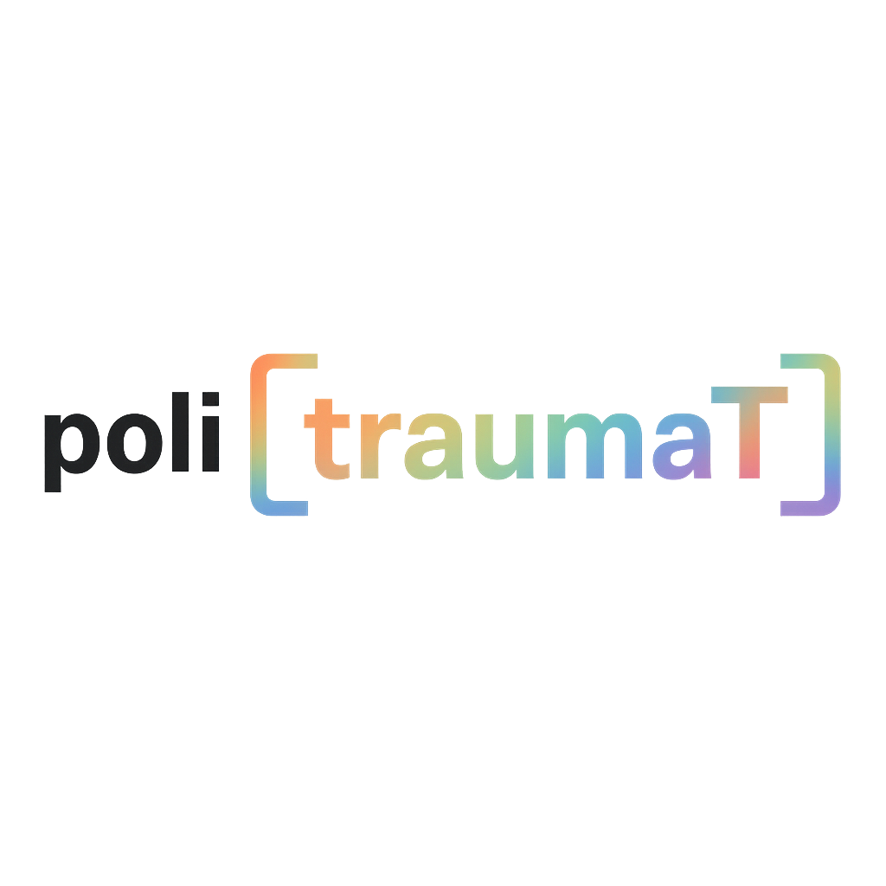

# politraumat
My own UPV-themed Anki-style flashcards (single HTML file)

## What it is (super simple)
**politraumat** is a tiny flashcard app that runs in your phone or desktop browser. It’s just one HTML file, no server, no install. You load a deck, swipe to grade each card, and your progress is saved automatically in your browser (localStorage).

## How it works (in plain words)
- Tap a card to flip between **Front** and **Back**.
- Swipe **left = Again**, **down = Hard**, **up = Good**, **right = Easy**.
- The next card is shown underneath; animations are smooth and taps don’t trigger long-press weirdness.
- A small bar shows **Remaining**, **Done**, and **Mastered**.

## Import / Export
- **Import**: CSV with headers `Front,Back` (new lines allowed inside quotes) **or** JSON.
- **Export**: Saves **everything** (deck + your full progress + queue) to a JSON file, so you can back up and restore later.

## Settings (bottom sheet ⚙️)
- Choose where graded cards go (**Again/Hard/Good/Easy positions**).
- Set how many correct passes are needed to “master” a card.
- Pick the initial order (**Shuffle** or **Original**).
- Start showing **Front** or **Back** by default.

## Why it’s nice
- Mobile-first dark UI with the **poli[traumaT]** rainbow logo.
- Single file, fast to share and open.
- Your study state persists automatically—close the tab and come back later right where you left off.
